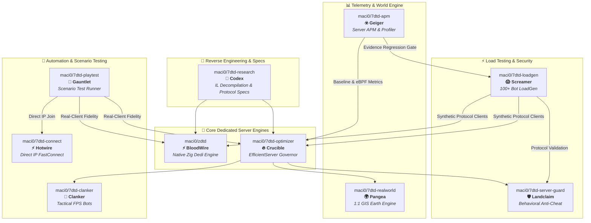

# HordeForge

# 🧟‍♂️ HordeForge

**High-Performance Systems Engineering, Engine Infrastructure, & Zero-Overhead Tooling for 7 Days to Die**

[-red.svg)](https://7daystodie.com/)

[-brightgreen.svg)]()

---

> 📌 **Repository Location & Migration Notice**: HordeForge repositories are currently hosted under the primary developer handle **[`@maci0`](https://github.com/maci0)** (e.g. `github.com/maci0/7dtd-optimizer`). They will be officially transferred to the `hordeforge/` organization space in an upcoming migration wave.

---

## 📌 Overview

**HordeForge** is an open-source engineering collective dedicated to pushing the performance, stability, and scale limits of **7 Days to Die** dedicated servers. 

Our suite spans low-level Mono/IL reverse engineering, a zero-allocation native server rewrite in Zig, adaptive C# runtime overload governors, continuous eBPF/GC telemetry, synthetic 100+ client protocol load generators, neural combat bots, 1:1 GIS planetary terrain streaming, and server-side behavioral anti-cheat.

---

## 🛠️ Repository Ecosystem (Hybrid Lore + Descriptive Suite)

### 🚀 Servers & Engine Runtimes
| Hybrid Product Name | Current Repository URL | Internal `Mods/` Folder | Tech Stack | Role & Description |
|---|---|---|---|---|
| **⚡ BloodWire** *(ZDTD Engine)* | [`maci0/zdtd`](https://github.com/maci0/zdtd) | *(Native Server)* | `Zig` | **ZDTD — Zeven Days to Die**: A zero-allocation, high-throughput dedicated server written from scratch in Zig targeting the stock client wire protocol. |
| **🔥 Crucible** *(EfficientServer)* | [`maci0/7dtd-optimizer`](https://github.com/maci0/7dtd-optimizer) | `0_HordeForge_Crucible` | `C# (.NET 4.8)` | **HordeForge EfficientServer**: Adaptive overload governor, AI LOD throttling, and runtime Harmony performance patches for stock Mono dedicated servers. |
| **🌍 Pangea** *(RealEarth)* | [`maci0/7dtd-realworld`](https://github.com/maci0/7dtd-realworld) | `HordeForge_Pangea` | `C# / Python GIS` | **RealEarth**: 1:1 scale Earth terrain engine for 7DTD featuring offline tile packing, longitude wrap, and dynamic tile streaming. |

### 📊 Observability & Testing Infrastructure
| Hybrid Product Name | Current Repository URL | Internal `Mods/` Folder | Tech Stack | Role & Description |
|---|---|---|---|---|
| **☣️ Geiger** *(Server APM)* | [`maci0/7dtd-apm`](https://github.com/maci0/7dtd-apm) | `HordeForge_Geiger` | `C# / Python / SQLite` | **HordeForge Server APM**: Performance monitoring, eBPF kernel profiling, eGC freeze detection, and automated regression gating (`EfficientTelemetry`). |
| **😱 Screamer** *(LoadGen)* | [`maci0/7dtd-loadgen`](https://github.com/maci0/7dtd-loadgen) | *(CLI Tool)* | `C# (.NET 8.0)` | **HordeForge LoadGen**: Headless LiteNetLib synthetic protocol client generator for high-concurrency 100+ bot server stress testing. |
| **🥊 Gauntlet** *(Playtest Runner)* | [`maci0/7dtd-playtest`](https://github.com/maci0/7dtd-playtest) | *(Python Test Runner)* | `Python 3.13 / C#` | **HordeForge Playtest Runner**: End-to-end automated scenario test suite driving stock 7DTD clients to verify server state and fidelity. |
| **⚡ Hotwire** *(FastConnect)* | [`maci0/7dtd-connect`](https://github.com/maci0/7dtd-connect) | `HordeForge_Hotwire` | `C#` | **HordeForge FastConnect**: Client utility for direct-IP joining, EULA/intro boot skipping, and headless client test launching. |

### 🛡️ Security, AI, & Infrastructure
| Hybrid Product Name | Current Repository URL | Internal `Mods/` Folder | Tech Stack | Role & Description |
|---|---|---|---|---|
| **🛡️ Landclaim** *(ServerGuard)* | [`maci0/7dtd-server-guard`](https://github.com/maci0/7dtd-server-guard) | `HordeForge_Landclaim` | `C# (.NET 4.8)` | **HordeForge ServerGuard**: Server-side behavioral anti-cheat, inventory conservation enforcement, and state transition validation. |
| **🤖 Clanker** *(FPS Bots Mod)* | [`maci0/7dtd-clanker`](https://github.com/maci0/7dtd-clanker) | `HordeForge_Clanker` | `C# / TS / Python` | **Clanker FPS Bots**: Dedicated FPS combat bots with realistic movement heuristics, GA-trained neural decision brains, and Web UI. |
| **🏰 Outpost** *(Server Container)* | [`maci0/7dtd-server`](https://github.com/maci0/7dtd-server) | *(Podman Container)* | `Podman / Shell` | **HordeForge Server Container**: Production Podman container templates, staging orchestration, and systemd deployment. |
| **📜 Codex** *(Engine Research)* | [`maci0/7dtd-research`](https://github.com/maci0/7dtd-research) | *(Documentation)* | `Markdown / Cecil` | **7DTD Engine Research**: Reverse-engineering narratives, Mono IL decompilations, game loop maps, and wire protocol specs. |

---

## 🔄 The Evidence Loop & Architecture

HordeForge projects follow a strict evidence-driven development loop:

---

## 💡 Engineering Philosophy

1. **Evidence Over Claims**: Lower CPU usage alone is not an acceptance criterion. Performance improvements are validated using identical worlds, seeds, duration, and bot counts captured via `maci0/7dtd-apm`.
2. **20 TPS Target**: Dedicated servers operate on a strict 50 ms tick budget (20 TPS). We optimize for low latency, zero GC pauses, and bounded memory allocation.
3. **Clean Boundaries**: Measurement (`maci0/7dtd-apm`), optimization (`maci0/7dtd-optimizer`), client testing (`maci0/7dtd-loadgen`), and security (`maci0/7dtd-server-guard`) live in independent repositories and DLLs.
4. **EAC-Off C# Modding**: All C# code mods require Easy Anti-Cheat to be disabled (`-noeac`) on the server. Vanilla clients can join `maci0/7dtd-optimizer` and `maci0/zdtd` without client-side mods.

---

## 🚚 Future Migration Plan

All repositories listed above will be migrated from `github.com/maci0/<repo>` to `github.com/hordeforge/<repo-slug>` (e.g. `github.com/hordeforge/7dtd-server-optimizer`). Redirects will be configured on GitHub to preserve existing clone URLs and stars.

---

## 📄 License & Attribution

All HordeForge projects are licensed under open-source software licenses (MIT or Apache-2.0).

*7 Days to Die is a registered trademark of The Fun Pimps Entertainment LLC. HordeForge is an independent open-source project and is not affiliated with or endorsed by The Fun Pimps.*
