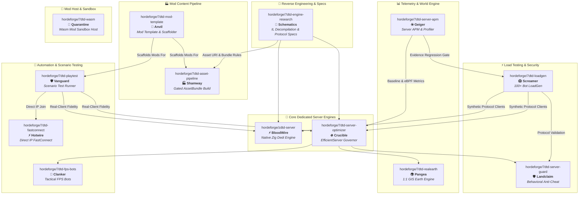

# HordeForge

# 🧟‍♂️ HordeForge

**High-Performance Systems Engineering, Engine Infrastructure, & Zero-Overhead Tooling for 7 Days to Die**

[-red.svg)](https://7daystodie.com/)

[-brightgreen.svg)]()

---

## 📌 Overview

**HordeForge** is an open-source engineering collective dedicated to pushing the performance, stability, and scale limits of **7 Days to Die** dedicated servers. 

Our suite spans low-level Mono/IL reverse engineering, a zero-allocation native server rewrite in Zig, adaptive C# runtime overload governors, continuous eBPF/GC telemetry, synthetic 100+ client protocol load generators, neural combat bots, 1:1 GIS planetary terrain streaming, and server-side behavioral anti-cheat.

---

## 🛠️ Repository Ecosystem (Hybrid Lore + Descriptive Suite)

### 🚀 Servers & Engine Runtimes
| Hybrid Product Name | Repository URL | Internal `Mods/` Folder | Tech Stack | Role & Description |
|---|---|---|---|---|
| **⚡ BloodWire** *(ZDTD Engine)* | [`hordeforge/zdtd-server`](https://github.com/hordeforge/zdtd-server) | *(Native Server)* | `Zig` | **ZDTD — Zeven Days to Die**: A zero-allocation, high-throughput dedicated server written from scratch in Zig targeting the stock client wire protocol. |
| **🔥 Crucible** *(EfficientServer)* | [`hordeforge/7dtd-server-optimizer`](https://github.com/hordeforge/7dtd-server-optimizer) | `0_HordeForge_Crucible` | `C# (.NET 4.8)` | **HordeForge EfficientServer**: Adaptive overload governor, AI LOD throttling, and runtime Harmony performance patches for stock Mono dedicated servers. |
| **🌍 Pangea** *(RealEarth)* | [`hordeforge/7dtd-realearth`](https://github.com/hordeforge/7dtd-realearth) | `HordeForge_Pangea` | `C# / Python GIS` | **RealEarth**: 1:1 scale Earth terrain engine for 7DTD featuring offline tile packing, longitude wrap, and dynamic tile streaming. |

### 📊 Observability & Testing Infrastructure
| Hybrid Product Name | Repository URL | Internal `Mods/` Folder | Tech Stack | Role & Description |
|---|---|---|---|---|
| **☣️ Geiger** *(Server APM)* | [`hordeforge/7dtd-server-apm`](https://github.com/hordeforge/7dtd-server-apm) | `HordeForge_Geiger` | `C# / Python / SQLite` | **HordeForge Server APM**: Performance monitoring, eBPF kernel profiling, eGC freeze detection, and automated regression gating (`EfficientTelemetry`). |
| **😱 Screamer** *(LoadGen)* | [`hordeforge/7dtd-loadgen`](https://github.com/hordeforge/7dtd-loadgen) | *(CLI Tool)* | `C# (.NET 8.0)` | **HordeForge LoadGen**: Headless LiteNetLib synthetic protocol client generator for high-concurrency 100+ bot server stress testing. |
| **🛡️ Vanguard** *(Playtest Runner)* | [`hordeforge/7dtd-playtest`](https://github.com/hordeforge/7dtd-playtest) | *(Python Test Runner)* | `Python 3.13 / C#` | **Vanguard**: End-to-end automated scenario test suite driving stock 7DTD clients to verify server state and fidelity. |
| **⚡ Hotwire** *(FastConnect)* | [`hordeforge/7dtd-fastconnect`](https://github.com/hordeforge/7dtd-fastconnect) | `HordeForge_Hotwire` | `C#` | **HordeForge FastConnect**: Client utility for direct-IP joining, EULA/intro boot skipping, and headless client test launching. |
| **👁️ Deadeye** *(Vision Review)* | [`hordeforge/7dtd-vision-review`](https://github.com/hordeforge/7dtd-vision-review) | *(CLI Tool)* | `Python 3.11+` | **HordeForge Deadeye**: Shared vision-model review gateway that submits a clip plus the author's recorded intent to a vision-capable model and returns structured, advisory feedback for the asset pipeline and playtest suites. |

### 🛡️ Security, AI, & Infrastructure
| Hybrid Product Name | Repository URL | Internal `Mods/` Folder | Tech Stack | Role & Description |
|---|---|---|---|---|
| **🛡️ Landclaim** *(ServerGuard)* | [`hordeforge/7dtd-server-guard`](https://github.com/hordeforge/7dtd-server-guard) | `HordeForge_Landclaim` | `C# (.NET 4.8)` | **HordeForge ServerGuard**: Server-side behavioral anti-cheat, inventory conservation enforcement, and state transition validation. |
| **🤖 Clanker** *(FPS Bots Mod)* | [`hordeforge/7dtd-fps-bots`](https://github.com/hordeforge/7dtd-fps-bots) | `HordeForge_Clanker` | `C# / TS / Python` | **Clanker FPS Bots**: Dedicated FPS combat bots with realistic movement heuristics, GA-trained neural decision brains, and Web UI. |
| **🏰 Outpost** *(Server Container)* | [`hordeforge/7dtd-server-container`](https://github.com/hordeforge/7dtd-server-container) | *(Podman Container)* | `Podman / Shell` | **HordeForge Server Container**: Production Podman container templates, staging orchestration, and systemd deployment. |
| **📜 Schematics** *(Engine Research)* | [`hordeforge/7dtd-engine-research`](https://github.com/hordeforge/7dtd-engine-research) | *(Documentation)* | `Markdown / Cecil` | **7DTD Engine Research**: Reverse-engineering narratives, Mono IL decompilations, game loop maps, and wire protocol specs. |
| **🏭 Shamway** *(Asset Pipeline)* | [`hordeforge/7dtd-asset-pipeline`](https://github.com/hordeforge/7dtd-asset-pipeline) | *(CLI Tool)* | `Python 3.11 / C# (Unity Editor)` | **HordeForge Asset Pipeline**: Builds a mod-owned Unity AssetBundle, or synthesizes texture, audio and text bundles with no editor at all, behind offline gates for the silent failures a successful Unity build does not catch. |
| **🔨 Anvil** *(Mod Template)* | [`hordeforge/7dtd-mod-template`](https://github.com/hordeforge/7dtd-mod-template) | *(Template)* | `Shell / Python / C# (.NET 4.8)` | **HordeForge Mod Template**: Scaffold for new 7DTD mods — modlet skeleton, offline gates, install-dependent validators, and the agent working discipline preinstalled; one config-driven run provisions tool checkouts, machine paths, and seeded docs. |
| **🧫 Quarantine** *(WasmHost)* | [`hordeforge/7dtd-wasm`](https://github.com/hordeforge/7dtd-wasm) | `1_HordeForge_WasmHost` | `C# / Rust / C / Zig` | **HordeForge Quarantine**: Embeddable WebAssembly sandbox host that runs untrusted mods (wasm32-wasip1) under fuel, memory, and module limits behind a documented ABI. |

---

## 🔄 The Evidence Loop & Architecture

HordeForge projects follow a strict evidence-driven development loop:

---

## 📚 7DTD Modding Best Practices Guide

HordeForge maintains the canonical **[7 Days to Die Modding Best Practices Guide](https://github.com/hordeforge/.github/blob/main/MODDING_BEST_PRACTICES.md)** for V3.2.0+ (Henpocalypse). Key engineering rules include:
- **Mod Hierarchy**: Clean separation between XML XPath modlets, compiled C# Harmony DLLs, and standalone native server engines.
- **Load Order Rules**: Alphabetical `Mods/` scanning conventions, `0_` prefixing for early-loading performance governors, and `ModInfo.xml` specifications.
- **EAC-Off Guidelines**: Rules governing Easy Anti-Cheat enforcement (`-noeac`) for C# code mods while maintaining vanilla client join compatibility.
- **Asset URI Protocols**: Texture, UI atlas, audio, and AssetBundle URI formatting (`#@modfolder:...`), gated offline by 🏭 Shamway.
- **Distribution Hygiene**: Flat zip structures (`Mods/<FolderName>/ModInfo.xml`) preventing nested directory bugs.

---

## 💡 Engineering Philosophy

1. **Evidence Over Claims**: Lower CPU usage alone is not an acceptance criterion. Performance improvements are validated using identical worlds, seeds, duration, and bot counts captured via `7dtd-server-apm`.
2. **20 TPS Target**: Dedicated servers operate on a strict 50 ms tick budget (20 TPS). We optimize for low latency, zero GC pauses, and bounded memory allocation.
3. **Clean Boundaries**: Measurement (`7dtd-server-apm`), optimization (`7dtd-server-optimizer`), client testing (`7dtd-loadgen`), and security (`7dtd-server-guard`) live in independent repositories and DLLs.
4. **EAC-Off C# Modding**: All C# code mods require Easy Anti-Cheat to be disabled (`-noeac`) on the server. Vanilla clients can join `7dtd-server-optimizer` and `zdtd-server` without client-side mods.

---

## 📄 License & Attribution

All HordeForge projects are licensed under open-source software licenses (MIT or Apache-2.0).

*7 Days to Die is a registered trademark of The Fun Pimps Entertainment LLC. HordeForge is an independent open-source project and is not affiliated with or endorsed by The Fun Pimps.*
